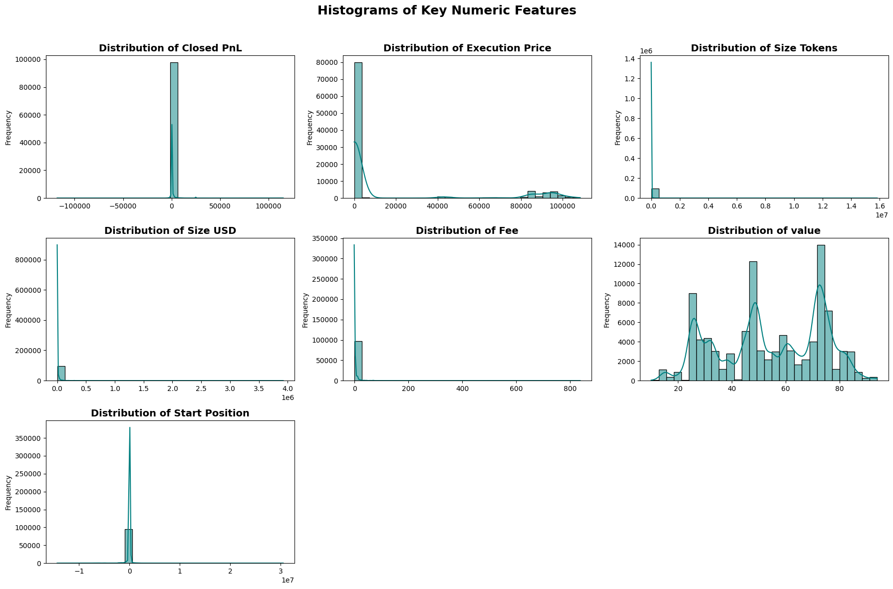

# Trader Performance & Market Sentiment Analysis

This project explores the relationship between trader performance and market sentiment using transaction data and sentiment indices. It includes data cleaning, exploratory data analysis (EDA), feature engineering, and classification modeling to predict market sentiment based on trading patterns.

## Project Overview

- **Objective:**  
  To analyze how trader performance correlates with market sentiment and build predictive models that classify market sentiment using trading data.

- **Datasets:**  
  - Trader transactions data (2024)  
  - Market sentiment data (Fear & Greed Index from 2018 to 2024)

- **Approach:**  
  - Data preprocessing and cleaning  
  - Feature engineering including encoding categorical variables  
  - Exploratory data analysis (visualizations, distributions, correlations)  
  - Building and evaluating classification models (Logistic Regression, Random Forest, XGBoost)  
  - Model validation and interpretation

## Exploratory Data Analysis (Sample Visualizations)

### Classification Label Distribution

  
*Shows the proportion of each market sentiment class in the dataset, with percentages displayed inside bars.*

### Histograms of Key Numeric Features


*Histograms for numerical variables like Closed PnL, Execution Price, Size Tokens, etc., showing their distributions.*

### Scatter Plot of Size USD vs Closed PnL by Sentiment


*Scatter plot colored by market sentiment showing relationship between trade size in USD and profit & loss.*

### Boxplot of Closed PnL by Classification


*This boxplot shows the distribution of closed profit and loss for each market sentiment class, highlighting medians and outliers.*

## Modeling Results

- Achieved up to **99% accuracy** on test data with models such as Logistic Regression, Random Forest, and XGBoost.
- Performance metrics including precision, recall, and F1-score confirm the robustness of the models.

## File Structure

- `fear_greed_index.csv` — Market sentiment data containing daily Fear & Greed scores  
- `trader_data.csv` — Trader transaction data for 2024  
- `Trader_Sentiment_Analysis.ipynb` — Jupyter notebook with full analysis, EDA, modeling, and results  
- `images/` — Folder containing all plot images used in this README

## How to Run

1. Clone the repository.  
2. Place the CSV data files in the working directory.  
3. Open the Jupyter notebook `Trader_Sentiment_Analysis.ipynb`.  
4. Run cells sequentially to reproduce the analysis and results.

## Dependencies

- Python 3.8+  
- pandas  
- numpy  
- matplotlib  
- seaborn  
- scikit-learn  
- xgboost

Install dependencies with:

```bash
pip install pandas numpy matplotlib seaborn scikit-learn xgboost


